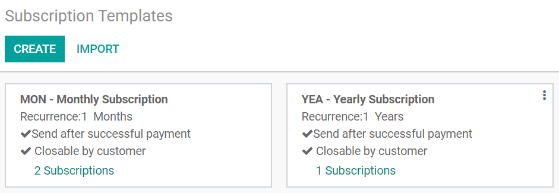
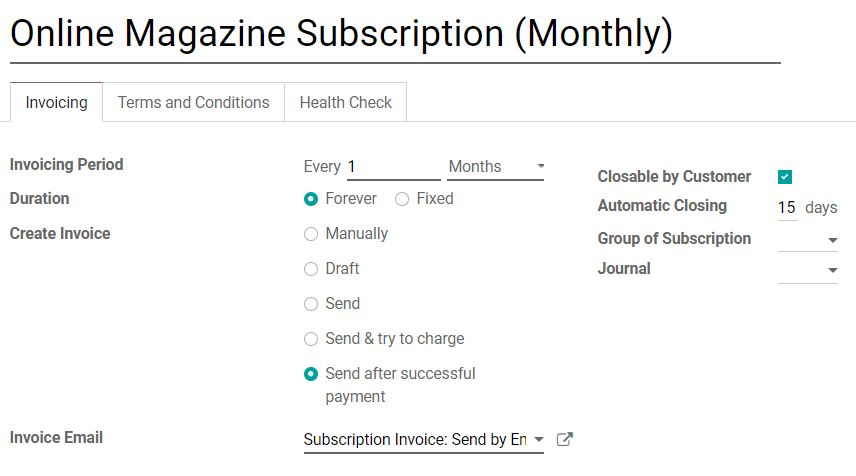

==========================
Use subscription templates
==========================

The subscription business model is becoming more and more popular. Are you wondering why? Because a
subscription model simplifies the business process and makes it very easy for both customers and the
business. It ensures that the business retains more customers on a consistent basis and that clients
can be reached out to and engaged with regularly. A business model like this makes it easy to
anticipate demand and supply. Finally, this model offers much higher payment security for your
business.

.. raw:: html

   
 <b>Simplicity. Higher customer retention.Opportunities
   for marketing. Business consistency. Better cash flow management</b> 

Odoo subscription templates will help you save a lot of time and money. Indeed, these templates will
help you generate recurring invoices and manage renewals at a fast pace. With Odoo you have the
possibility to create, edit and manage your own subscription templates.

Configuration
=============

Go to :menuselection:`Subscriptions → Configuration → Subscription templates`. By default, Odoo
suggests you two types of subscription (MON - Monthly subscription *vs* YEA - Yearly subscription).
Of course, you can create your own ones.

.. important::
   Installing the **Subscriptions** application will automatically install the **Sales** and
   **Invoicing** applications.

Create your first template
==========================

You can create a new template or edit an existing one. The first thing you need to do is give your
template a name. After that, you have to choose an invoicing period. It is possible to change the
amount and specify whether it is per days, weeks, months or years. The duration will determine if
the subscription will go on forever (until it’s manually closed) or for a fixed amount of time.
There are also several options for the payment mode. Something important here is that an additional
field appears when you choose “Send”, “Send & try to charge” and “Send after successful payment”.
This field gives you the possibility to add an invoice email template.

On each template, you can also configure some options for the customer portal. First of all, you are
going to be able to say if you want the customer to be able to close the subscription or not. After
that, you have the automatic closing limit, the group of subscription and the journal options that
you can also manage directly from the subscription templates.

.. note::
   For each template, you can add your **Terms and Conditions** and your **Health Check**.

.. important::
   After creating your own subscription template, be sure to check out our documentation about
   :doc:`subscription_products`.

.. seealso::
   - :doc:`subscription_products`
